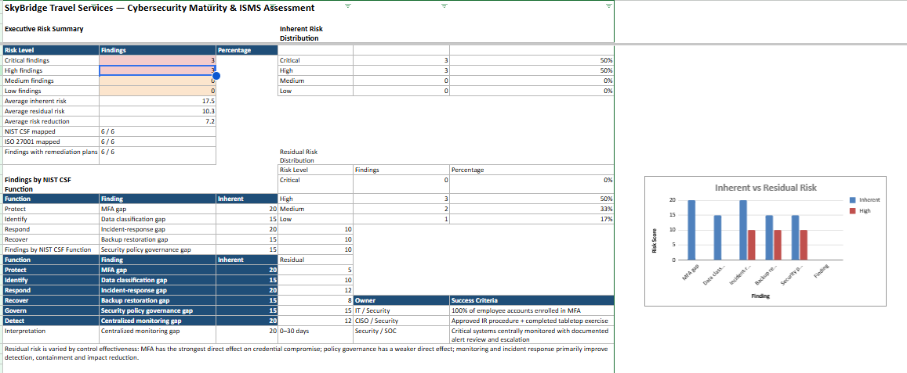
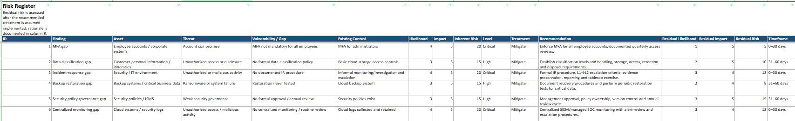
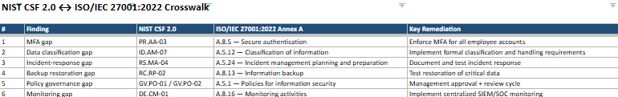
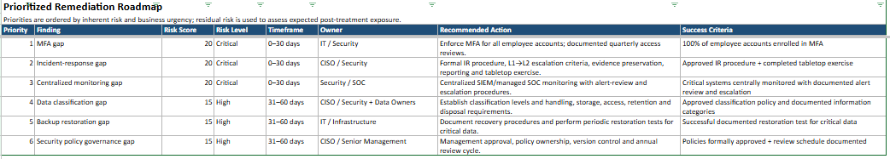

# Cybersecurity Maturity and ISMS Assessment

A simulated cybersecurity maturity assessment for SkyBridge Travel Services using NIST CSF 2.0 and selected ISO/IEC 27001:2022 controls.

## Project Overview

This project demonstrates how a cybersecurity and information security assessment can be structured for a fictional travel services organisation.

The assessment looks at six priority areas:

1. Identity and access management
2. Information classification
3. Incident response
4. Backup and recovery
5. Security policy governance
6. Security monitoring

The assessment identifies control gaps, evaluates risk, maps findings to NIST CSF 2.0 and ISO/IEC 27001:2022, and provides a prioritised remediation roadmap.

## Organisation

SkyBridge Travel Services is a fictional organisation with approximately 150 employees.

The organisation provides:

* Travel bookings
* Itinerary management
* Customer support
* Cloud based services
* Microsoft 365
* Company managed laptops
* Remote and hybrid working
* Third party services
* External payment providers

The environment contains customer and employee personal information, booking and itinerary information, corporate accounts, cloud workloads, security logs and backup infrastructure.

## Key Findings

The assessment identified six control gaps.

| Area | Inherent Risk | Residual Risk |
|---|---:|---:|
| MFA coverage | 20 Critical | 5 Low |
| Data classification | 15 High | 10 Medium |
| Incident response | 20 Critical | 12 High |
| Backup restoration | 15 High | 8 Medium |
| Security policy governance | 15 High | 15 High |
| Centralized monitoring | 20 Critical | 12 High |

The average inherent risk score was 17.5 out of 25.

The estimated average residual risk after the recommended treatments was 10.3 out of 25.

## NIST CSF 2.0

The findings were mapped across the NIST CSF functions:

* Govern
* Identify
* Protect
* Detect
* Respond
* Recover

Examples include:

| Finding | NIST CSF 2.0 |
|---|---|
| MFA | PR.AA-03 |
| Data classification | ID.AM-07 |
| Incident response | RS.MA-04 |
| Backup recovery | RC.RP-02 |
| Policy governance | GV.PO-01 / GV.PO-02 |
| Security monitoring | DE.CM-01 |

## ISO/IEC 27001:2022

Selected Annex A controls were assessed against the identified gaps.

Examples include:

* A.8.5 Secure authentication
* A.5.12 Classification of information
* A.5.24 Incident management planning and preparation
* A.8.13 Information backup
* A.5.1 Policies for information security
* A.8.16 Monitoring activities

## Risk Methodology

Risk was calculated using:

**Likelihood × Impact**

Both likelihood and impact were scored from 1 to 5.

The resulting risk levels were:

* 1 to 5: Low
* 6 to 10: Medium
* 11 to 15: High
* 16 to 25: Critical

Residual risk was estimated based on how directly each recommended treatment would reduce the identified risk.

## Remediation Priorities

The highest priority recommendations were:

1. Enforce MFA for all employee accounts
2. Formalise and test the incident response process
3. Implement centralized security monitoring
4. Establish a formal information classification scheme
5. Test restoration of critical backups
6. Establish formal security policy approval and review

## Project Deliverables

### Assessment Report

[View the Cybersecurity Maturity and ISMS Assessment Report](./SkyBridge_Cybersecurity_Maturity_ISMS_Assessment_Report.pdf)

### Assessment Workbook

[View the Cybersecurity Maturity and ISMS Assessment Workbook](./SkyBridge_Cybersecurity_Maturity_ISMS_Assessment.xlsx)

The workbook contains the assessment dashboard, NIST CSF assessment, ISO 27001 gap assessment, risk register, Statement of Applicability, NIST to ISO mapping and remediation roadmap.
## Assessment Screenshots

### Executive Dashboard

### Risk Register

### NIST CSF 2.0 and ISO/IEC 27001:2022 Crosswalk

### Remediation Roadmap

## Skills Demonstrated

* Cybersecurity risk assessment
* Control gap analysis
* NIST CSF 2.0
* ISO/IEC 27001:2022
* Risk scoring
* Residual risk assessment
* Statement of Applicability
* Security governance
* Incident response planning
* Security monitoring
* Remediation planning
* Excel based risk reporting

## Scope and Limitations

This is a fictional portfolio project. No real organisational systems were accessed or technically tested.

The assessment covers six selected control areas and is not a complete NIST CSF or ISO/IEC 27001 assessment.

Vulnerability management and the AI customer service agent were identified as potential future assessment areas but were outside the scope of this project.

The risk ratings and control states are simulated for portfolio purposes and were not independently verified.

This project should not be considered an ISO/IEC 27001 certification audit, legal compliance assessment, penetration test or technical security validation.
